<picture>
  <source media="(prefers-color-scheme: dark)" srcset="hero.svg">
  
</picture>

# harness-atlas

What AI coding harnesses **promise** — and what they **support** — with a version pin and a fetched-doc citation on every cell.

Ten harnesses, fourteen capabilities, one snapshot date: **2026-10-05**.

| | |
|---|---|
| [matrix.md](matrix.md) | the capability grid, symbols linked to per-harness pages |
| [matrix.yaml](matrix.yaml) | same grid, machine-readable, with `as_of` |
| [harnesses/](harnesses/) | one page per harness: promises, capability table with evidence links, notable findings |
| [SYNTHESIS.md](SYNTHESIS.md) | what the grid actually says — interop, transitions, trust models |
| [METHODOLOGY.md](METHODOLOGY.md) | how cells are produced and how to re-run |

## Why this exists

Capability comparisons of coding agents age in weeks and are usually written from memory. This atlas inverts that: researchers fetch official docs during the run, verdicts carry the URL and a verbatim quote they were read from, and versions are pinned to the release tag observed that day. A cell you cannot trace is marked `unknown`, never guessed.

## Read this first

If you only read one file, read [SYNTHESIS.md](SYNTHESIS.md). Short version: the capability floor has moved (subagents/hooks/skills are table stakes), the ecosystem is interoperating across vendor lines, and half the field is mid-transition — Roo Code discontinued, Gemini CLI superseded, Goose rebranded with plan mode removed. Dates are not metadata here; they are the claim.

## Symbols

✅ documented yes · ◐ partial (read the note) · ✗ documented no · ? unknown/unverified

---

Orvii — Open, Research, Vision, Innovation & Ideas. Regenerate with `scripts/generate.py` against a fresh research journal; see METHODOLOGY.
